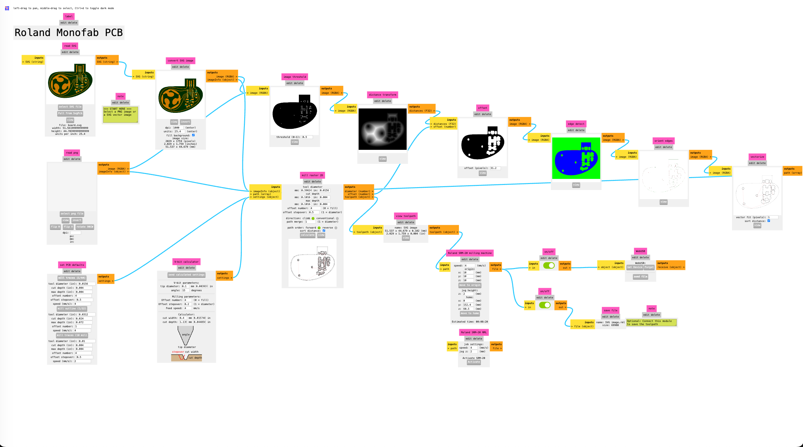

# Mods MCP Server

An [MCP (Model Context Protocol)](https://modelcontextprotocol.io/) server that bridges LLMs to [Mods CE](https://gitlab.fabcloud.org/pub/project/mods), the browser-based visual programming environment for digital fabrication.

Load a PCB design, configure milling parameters, generate toolpaths for a Roland SRM-20 — all through natural language via Claude, or any MCP-compatible client.

<p align="center">
  
  <br>
  <em>Sample test program to create a toolpath for PCB milling</em>
</p>

## What it does

The server launches a Mods CE instance in a Chrome browser via Playwright, serves it over HTTP, and exposes 12 MCP tools that let an LLM:

- **Discover** available programs (CNC mills, laser cutters, 3D printers) and modules (172 parsed)
- **Load** pre-built machine programs into the browser
- **Inspect** the full program state: modules, parameters, connections, and switch states
- **Configure** parameters like tool diameter, feed speed, cut depth, thresholds
- **Load files** (SVG, PNG) into reader modules for processing
- **Execute** workflows by triggering calculations and presets
- **Export** generated toolpath files (RML, G-code, etc.)
- **Create** custom programs by wiring modules together

## Supported Machines

Mods CE includes pre-built programs for:

- **Roland SRM-20** — PCB milling (2D traces, outlines), wax milling
- **Epilog** — Laser cutting/engraving
- **Prusa** — 3D printing
- **Shopbot** — CNC routing
- And more under `programs/machines/`

## Quick Start

### Prerequisites

- Node.js >= 18.0.0
- Google Chrome installed
- Git

### Installation

```bash
git clone --recurse-submodules https://github.com/lahoramaker/mods-mcp.git
cd mods-mcp
npm install
npx playwright install chrome
```

### Running the server

```bash
node src/server.js
```

This starts:
- An HTTP server on port 8080 serving Mods CE
- A Chrome browser window with Mods CE loaded
- An MCP server on stdio

Options:
- `--port 9090` — use a different HTTP port
- `--headless` — run Chrome in headless mode

## Configuration

### Claude Code

Add to your project's `.mcp.json`:

```json
{
  "mcpServers": {
    "mods": {
      "command": "node",
      "args": ["/absolute/path/to/mods-mcp/src/server.js"]
    }
  }
}
```

### Claude Desktop

Add to `~/Library/Application Support/Claude/claude_desktop_config.json` (macOS):

```json
{
  "mcpServers": {
    "mods": {
      "command": "node",
      "args": ["/absolute/path/to/mods-mcp/src/server.js"],
      "env": {}
    }
  }
}
```

## MCP Tools

| Tool | Description |
|------|-------------|
| `get_server_status` | Server health, browser state, HTTP URL, loaded program |
| `list_programs` | List available programs by category |
| `list_modules` | List available modules by category |
| `get_module_info` | Parse a module's inputs, outputs, and types |
| `load_program` | Load a program into the browser |
| `get_program_state` | Read all modules, parameters, connections, and switch states |
| `set_parameter` | Set a parameter value in a module |
| `trigger_action` | Click a button in a module (calculate, presets, etc.) |
| `load_file` | Load a file into a module's file input |
| `create_program` | Build a custom program from modules and connections |
| `save_program` | Save the current program state to a file |
| `export_file` | Retrieve the most recently generated output file |

## Example: PCB Milling Workflow

Here's the sequence to generate a milling toolpath from an SVG PCB design:

```
1. get_server_status         → verify browser is connected
2. load_program              → "programs/machines/Roland/SRM-20 mill/mill 2D PCB"
3. get_program_state         → inspect modules, find on/off switches
4. set_parameter             → toggle save file switch ON (see note below)
5. trigger_action            → apply preset "mill traces (1/64)"
6. load_file                 → load SVG into "read SVG" module
7. trigger_action            → click "calculate" on "mill raster 2D"
8. export_file               → retrieve the generated .rml toolpath
```

### On/Off Switch Pattern

Machine programs use **on/off switch modules as gates** at the end of the pipeline:

- The switch to **WebUSB** (machine output) is **ON** by default
- The switch to **save file** (disk output) is **OFF** by default

To save toolpaths to a file instead of sending to a machine, use `get_program_state` to find the on/off switch connected to `save file`, then toggle it ON with `set_parameter`. The `connectedTo` / `connectedFrom` fields in the state output show which switch controls which path.

## Architecture

```
mods-mcp/
├── src/
│   ├── server.js      # MCP server + HTTP static file server
│   ├── browser.js     # Playwright browser automation
│   ├── programs.js    # Program discovery and creation
│   └── modules.js     # Module introspection via vm sandbox
├── mods/              # Mods CE (git submodule)
├── .claude/
│   └── commands/
│       └── mods-workflow.md  # Claude Code slash command guide
├── .mcp.json          # Claude Code MCP configuration
├── CLAUDE.md          # Platform internals documentation
└── package.json
```

## Documentation

See [docs/architecture.md](docs/architecture.md) for C4 architecture diagrams including:
- **System Context** — how the MCP server fits into the LLM + Mods + machine ecosystem
- **Container Diagram** — the three main containers inside the server process
- **Component Diagram** — detailed view of the four source modules
- **Sequence Diagram** — complete data flow for a PCB milling workflow
- **Internal Pipeline** — how data flows through Mods CE modules

## Claude Code Integration

This repo includes a `/mods-workflow` slash command for Claude Code that teaches the LLM how to use the MCP tools correctly, including the on/off switch gating pattern, module disambiguation, and checkbox handling.

## License

The Mods CE submodule is maintained by the [Mods project](https://gitlab.fabcloud.org/pub/project/mods) at MIT's Center for Bits and Atoms. See the submodule for its license terms.

---

The code in this repo was generated using Claude Code (Opus 4.6) and OpenSpec workflows.
