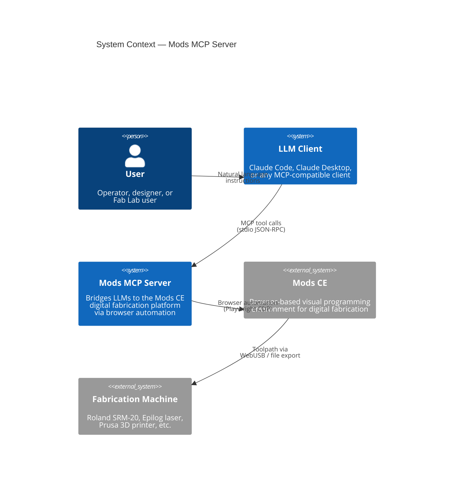
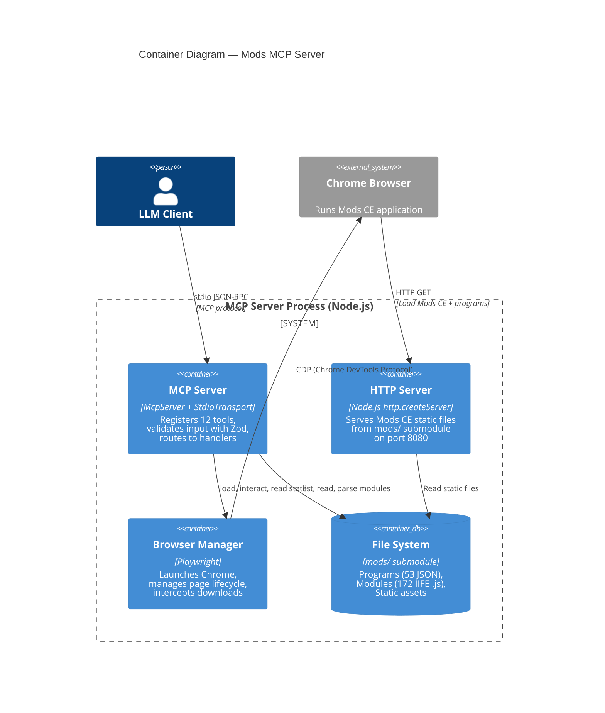
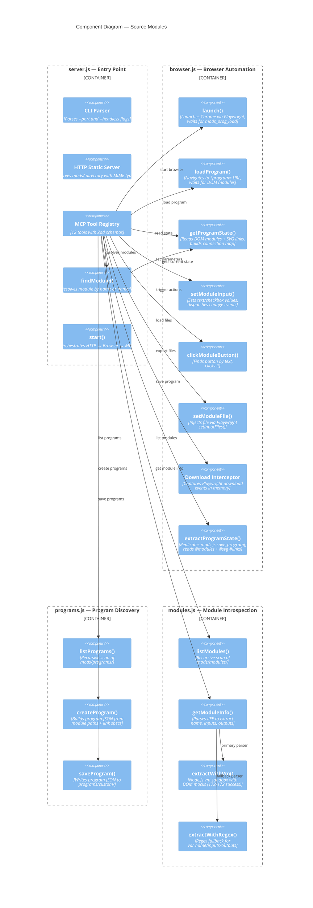
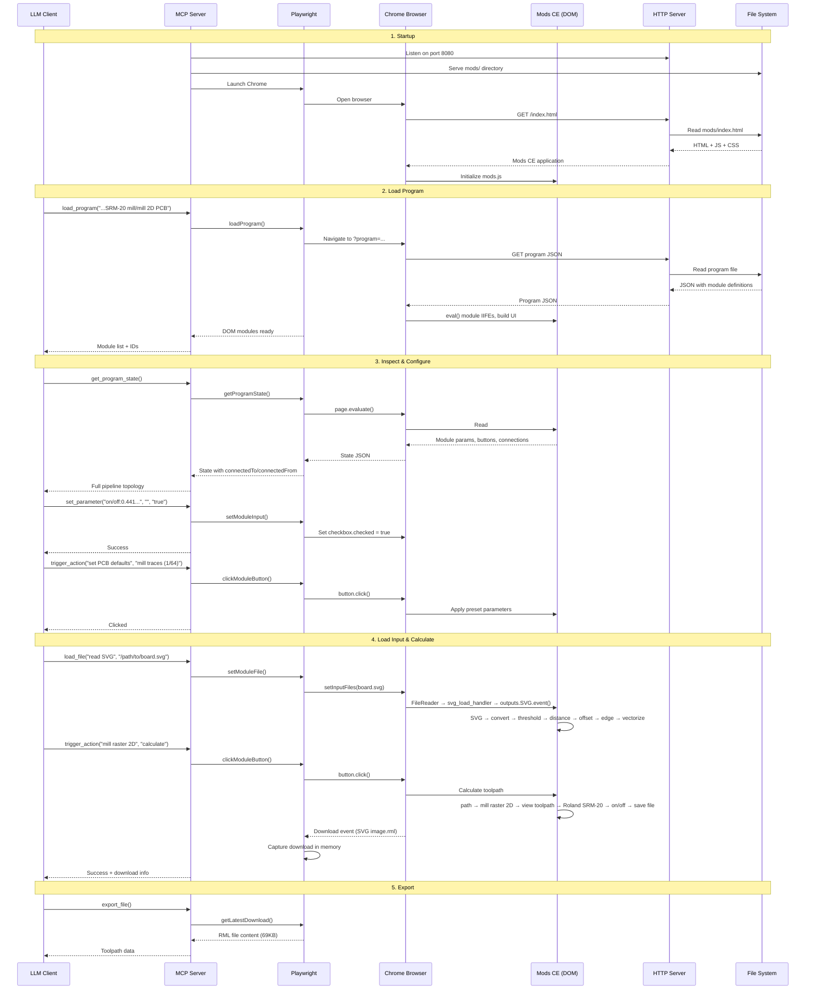
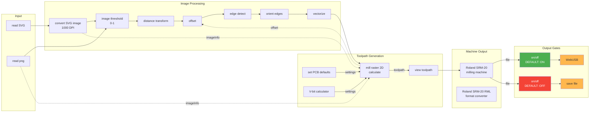

# Architecture

C4 model documentation for the Mods MCP Server.

## Level 1: System Context

Shows how the MCP server fits into the broader ecosystem — who uses it and what external systems it depends on.

## Level 2: Container Diagram

The MCP server process contains three main containers: the MCP protocol handler, an HTTP server, and a managed browser instance.

## Level 3: Component Diagram

Detailed view of the four source modules and how they collaborate.

## Sequence Diagram: PCB Milling Workflow

Shows the complete data flow when an LLM generates a PCB toolpath.

## Data Flow: Mods CE Internal Pipeline

How data flows through a typical PCB milling program inside the Mods CE browser.

## Key Design Decisions

### Why Playwright instead of direct DOM manipulation?

Mods CE was designed as a standalone browser application. Its core runtime (`mods.js`) uses closures, `eval()`, and direct DOM manipulation that make it impossible to run in Node.js. Playwright lets us control the real application exactly as a human would, while also providing:

- **Download interception** for capturing generated toolpath files
- **File input injection** via `setInputFiles()` for loading SVG/PNG designs
- **JavaScript evaluation** for reading DOM state and triggering events
- **Page navigation** for loading different programs

### Why a vm sandbox for module parsing?

Module IIFE source files define their inputs/outputs inside closures. Simple regex extraction misses complex cases (computed types, conditional ports). The Node.js `vm` module lets us evaluate each IIFE in an isolated sandbox with minimal DOM mocks, achieving 100% parse rate (172/172 modules) without executing any browser-dependent code.

### Why double-stringified links?

This is a Mods CE design choice, not ours. Program JSON stores connections as an array of JSON strings, where each string parses to an object whose `source` and `dest` fields are themselves JSON strings. Three levels of parsing are needed. Our `extractProgramState()` and `createProgram()` functions handle this encoding transparently.

### Why connection topology in get_program_state?

The original state only showed module names, parameters, and buttons — with no indication of how modules connect. This made it impossible for an LLM to distinguish between two `on/off` switches or understand the data flow. By parsing the SVG link elements, we expose `connectedTo` and `connectedFrom` on each module, enabling the LLM to reason about the pipeline.
